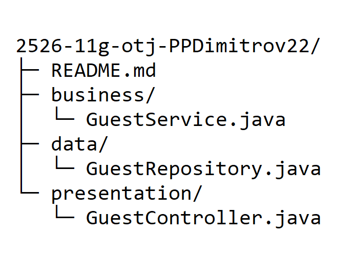

<h1 align="center">Hotel Management system</h1>

## 💻 About

Hotel Management system is a software solution that helps businesses organize, track, and improve their hotel management . 

 

## 🗂️ Core Tech Stack

### Used code editor & collaborative service

## 📁 Project Layout

    

### Used technologies for development

    

### Used tools for our documentation & presentation

<h1 align="center">Since you came all the way here, why don't you give us a ⭐️ :)
   